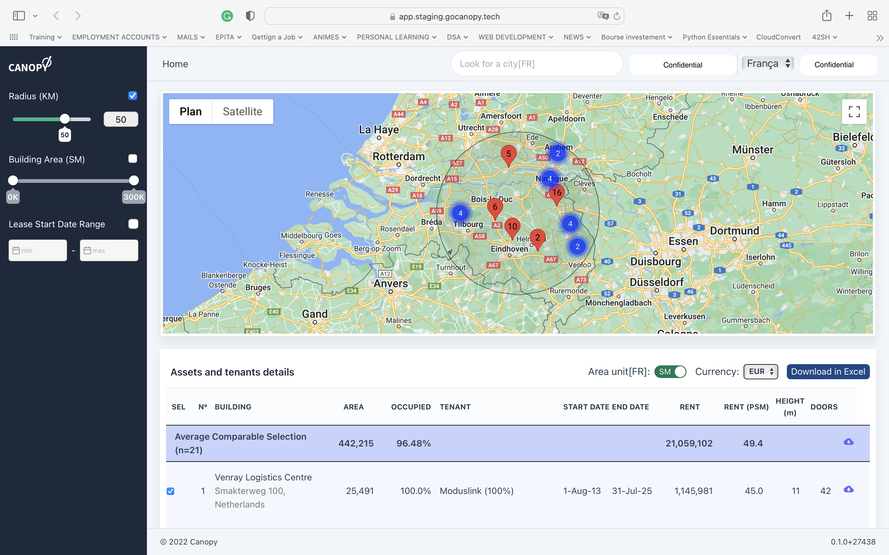
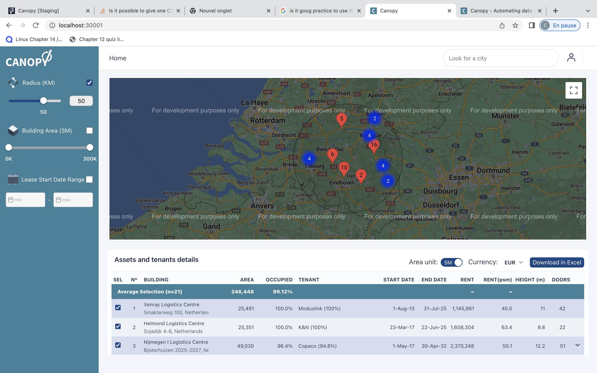

  

<h1>Canopy Internship Work Overview</h1>

This repository's purpose is to presents the work I've done during my internship at Canopy

As the SAAS's code belongs to Canopy, I am unable to upload the code to this repository. But below are some of the main points I worked on during the inernship

<ul>
<li>
    <h3>Helped Design and Develop the marketing website for the product</h3>
    
link to the website <a href="https://lively-crepe-04b0ca.netlify.app">MARKETING WEBSITE</a> (Not done yet as it was not among the prority tickets)

</li>
<li>
    <h3>Wrote Python scripts in order to extract data from an XML file, read and extract data from a table in a PDF file and extract images from a PDF file.</h3>
    
There was a client who had a considerable amount of data in 3 pdf files that were sent to us so I was asked to write scripts in order to extract that data automatically.

  
    ** The scripts can be found above. ** 
    <ul>
        <li>
            <h4>PDFParser</h4>
            
 Read the pdf files and extract data from tables within the file. Then the extracted data is stored in a csv file which can be easily exported to Excel.

        </li>
        <li>
            <h4>ImageParser</h4>
            
Read the pdf files and extract images which are then stored locally before being transfered to an S3 amazon server.

        </li>
    </ul>
</li>
<li>
    <h3>Updated the UI of the SAAS for it to be more user-friendly and uniform</h3>
    

    <h4>BEFORE</h4>
    
    <h4>AFTER</h4>
    
    

</li>
<li>
    <h3>Translated the GitLab CI/CD scripts into Github Actions scripts as it was required to move the code's repository from Gitlab to Github.</h3>
 </li>
</ul>
